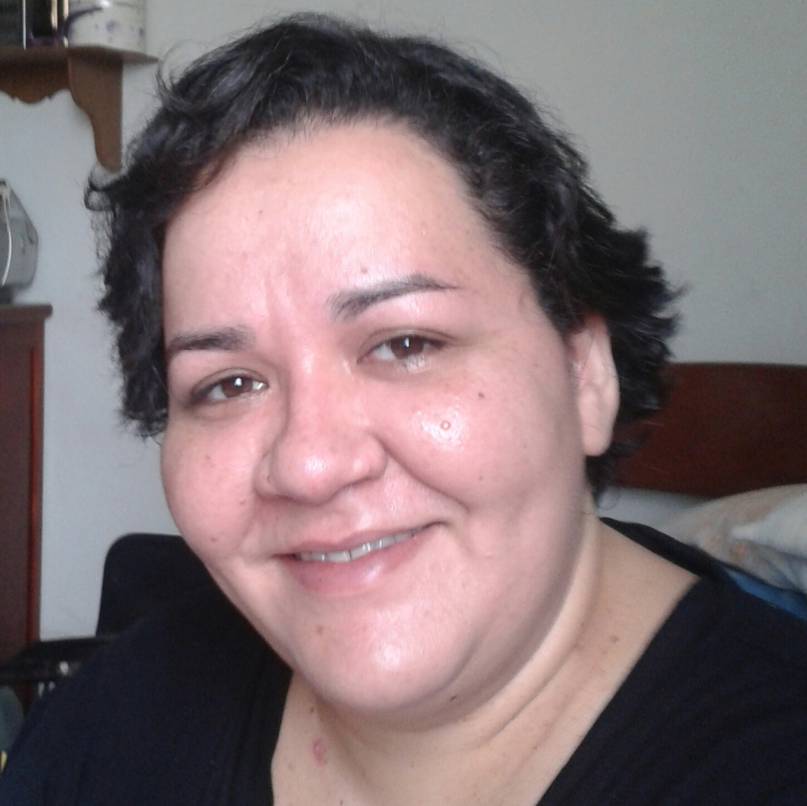

[CV Lattes](http://lattes.cnpq.br/9138505434158075)

{: class="img-responsive" style="float: left;margin-right: 10px;margin-top: 10px;" width="200px"}

Cristiane Rocha is a Post-doctoral fellow at the Laboratory of Biostatistics and Computational Biology at University of Campinas. She is responsible for managing the genomic databases, supervision and development of new tools for database and interface improvement.
