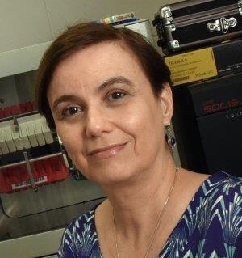

[CV Lattes](http://lattes.cnpq.br/3944020856408245)

{: class="img-responsive" style="float: left;margin-right: 10px;margin-top: 10px;" width="200px"}

Dr. Iscia Lopes-Cendes is a physician scientist, professor of Medical Genetics and head of the laboratory of Molecular Genetics at the department of Medical Genetics, School of Medical Sciences, University of Campinas (UNICAMP), BRAZIL. She obtained her M.D. degree at UNICAMP, followed by a medical specialty training in pediatrics. She obtained her Ph.D. degree in Neuroscience at McGill University, Canada.

Dr. Lopes-Cendes works in the field of neurogenetics, focusing on the study of genetic and phenotypic markers in neurologic disorders, such as epilepsy, Huntington disease, spinocerebellar ataxias (SCAs), familial spastic paraplegia, and stroke. Currently, she is particularly interested in studying the underlying molecular mechanisms leading to disease, aiming to finding better treatment options and prevention. In recent years, her laboratory has focused on the use of new genomic techniques in order to answer some of these biological and clinical questions. Currently, her laboratory is a reference center in Latin America for next generation sequencing technologies, bioinformatics analysis of complex genomic data and non-coding RNAs.

Dr. Lopes-Cendes has served at the genetics commission of the International League against Epilepsy, the neurogenetics commission of the American Academy of Neurology (AAN), and she is currently serving in the international subcommittee of the AAN. She received several honors and awards for her scientific contributions, and she is an elected member of the Brazilian Academy of Sciences.

Dr. Lopes-Cendes is the head of the Neurogenetics outpatient clinic at UNICAMP University hospital, and she was responsible for introducing the first presymptomatic testing clinic for late onset neurodegenerative disorders in Brazil. She is also scientific advisor in patients’ advocacy associations (Brazilian Association of Hereditary Ataxias and the Brazilian Huntington Association).
