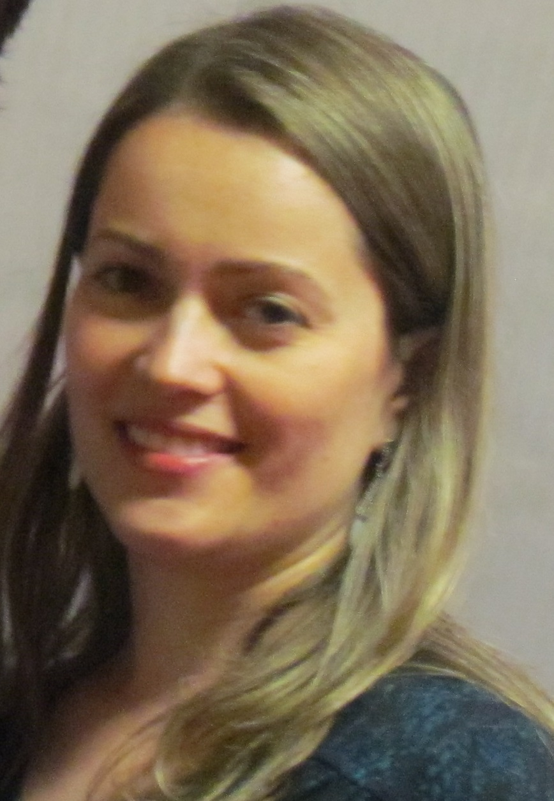

[CV Lattes](http://lattes.cnpq.br/4356116077235390)

{: class="img-responsive" style="float: left;margin-right: 10px;margin-top: 10px;" width="200px"}

Dr. Joseane Morari has a degree in biological sciences from the University of Campinas – UNICAMP, followed by Master´s and PhD degrees at the same University, in the area of Structural, Cellular, Molecular and Developmental Biology. She is a Biologist at the Obesity and Comorbidities Research Center (OCRC – CEPID FAPESP) and is currently associate researcher at the Laboratory of Pathophysiology and Pharmacology of Diabetes Mellitus at UNICAMP. Her current research aims to investigate the interaction between hunger and reward control systems in spontaneously lean and obese animals submited to normocaloric diet.
