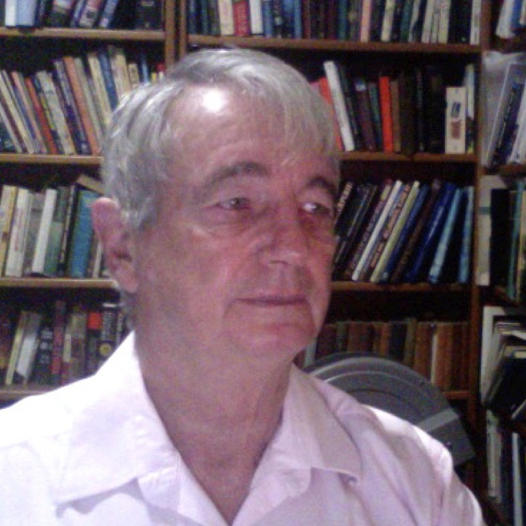

[Google Scholar](https://scholar.google.com.br/citations?user=hrRixG0AAAAJ&hl=pt-BR)

{: class="img-responsive" style="float: left;margin-right: 10px;margin-top: 10px;" width="200px"}

Peter Pearson trained as a clinical cytogeneticist with the MRC at Oxford after receiving his doctorate on a thesis about plant chromosomes at Durham, UK. He attended the famous chromosome nomenclature conference at Paris in 1971 and was a signatory of the original document and remained an advisor to the nomenclature committee for about 15 years. In 1972 he moved from Oxford to Leiden and established a new cytogenetics section within the Dept. of Human Genetics. At national level he participated in establishing structured genetic services in the Netherlands, which almost immediately led to the Netherlands having one of the best genetic health care systems in the world. His research changed from observing chromosomes to mapping human genes and he attended all the human gene mapping meetings. In 1978 he was appointed chairman of the department in Leiden and started research into neuromuscular diseases, particularly DMD. His group commenced DMD testing using DNA markers, which, within one year, led to a 70% reduction of pregnancy terminations of at risk male offspring in Dutch DMD families. The group was the first in the world to perform a prenatal diagnosis for DMD. In 1999 he left Leiden and was appointed scientific director of GDB, the Genome Data-Base at Johns Hopkins, Baltimore; this was the first major database to arise from the Human Genome Program and provided the physical mapping data for human genes. There, amongst other things, he facilitated making Victor McKusick’s famous catalogue available online without cost to users. In 1995, Pearson left the Human Genome Program to set up a new department of human genetics in Utrecht, the Netherlands, where he remained until his obligatory retirement in 2004. Following, he came to Brazil with his Brazilian wife Carla Rosenberg and in 2005 was appointed as a mainly unpaid visiting professor at USP until the present. He was vice-chairman of the Dutch Medical Research Council between 1980 and 1986 and represented the Netherlands in several EU medical research committees. He was made a foreign-member of the Dutch Royal Academy of Sciences in 1992. He has about 450 articles to his name and an H-index of 68.
