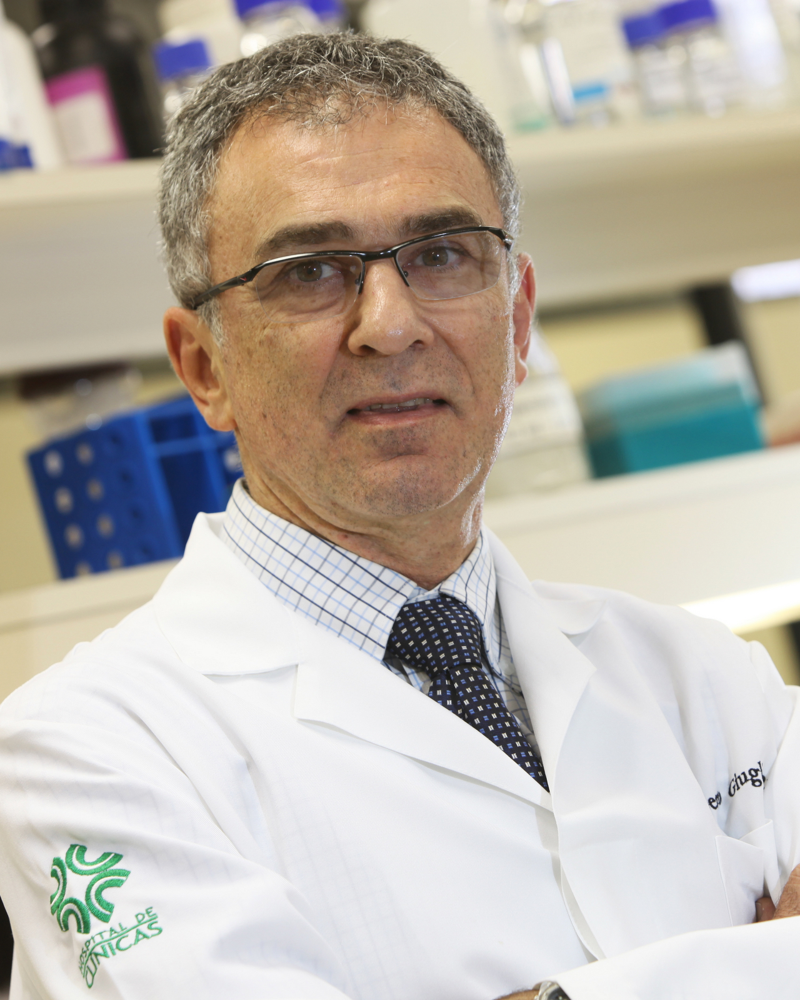

[CV Lattes](http://lattes.cnpq.br/8023869177216297)

{: class="img-responsive" style="float: left;margin-right: 10px;margin-top: 10px;" width="200px"}

Dr. Roberto Giugliani, MD, PhD, is Professor at the Department of Genetics of the Federal University of Rio Grande do Sul, Director of the WHO Collaborating Centre for the Development of Medical Genetics Services in Latin America, and Coordinator of the National Institute of Population Medical Genetics, in Porto Alegre, Brazil. Is also a member of the Medical Genetics Service of Hospital de Clinicas de Porto Alegre, Editor-in-Chief of the Journal of Inborn Errors of Metabolism and Screening, and President of the Latin American Society of Inborn Errors of Metabolism and Newborn Screening. Prof. Giugliani’s main interests are concentrated in the field of the lysosomal diseases, being author of more than 450 scientific papers.
