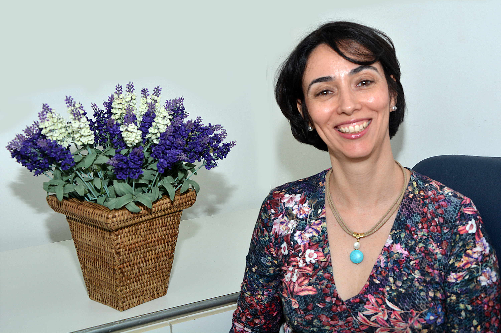

[CV Lattes](http://lattes.cnpq.br/1888360760491560)

{: class="img-responsive" style="float: left;margin-right: 10px;margin-top: 10px;" width="200px"}

Medical Geneticist and Full Professor of the Department of Medical Genetics of the Faculty of Medical Sciences of UNICAMP, where she was responsible for the Laboratory of Human Cytogenetics and Cytogenetics (2005-2015). She has idealized and coordinated the Brazil´s CranioFacial Project since 2003. Member of Human Variome Project Consortium since 2008.
